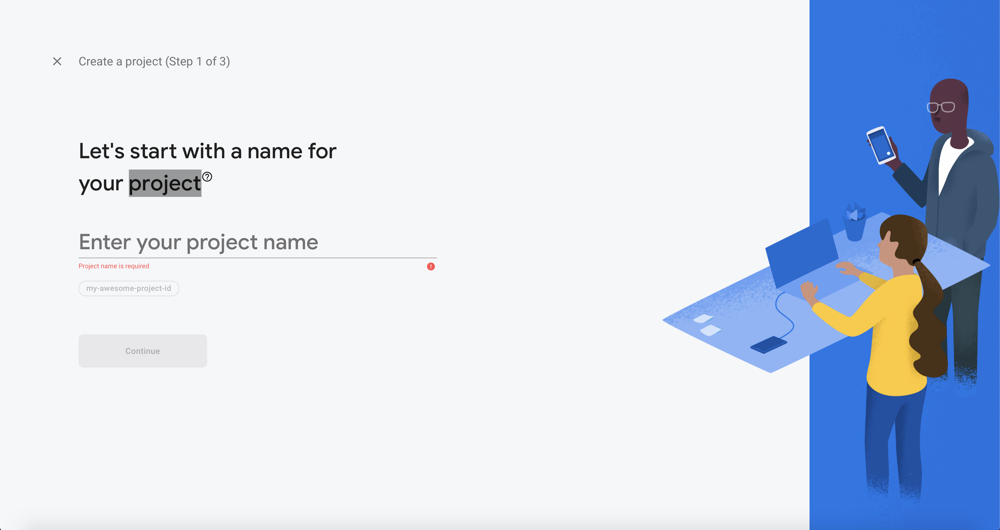
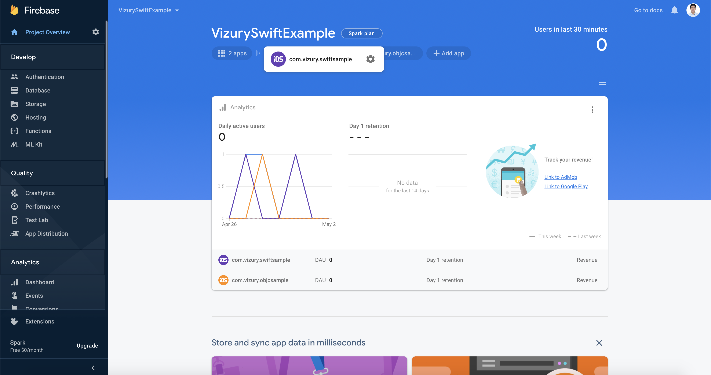
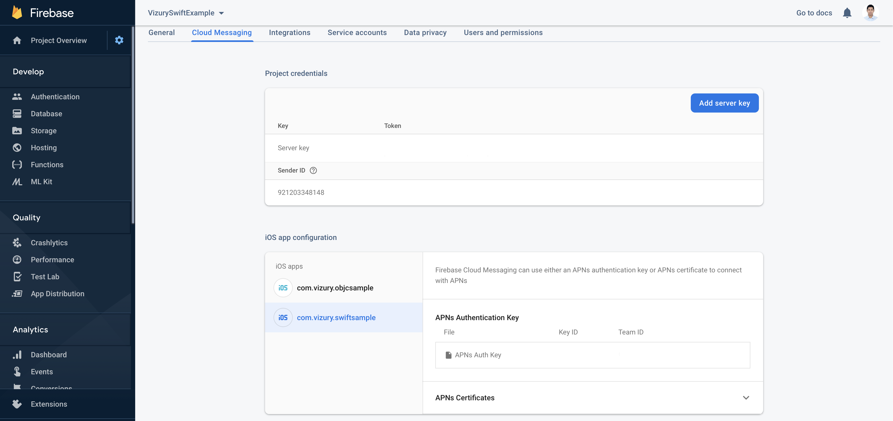
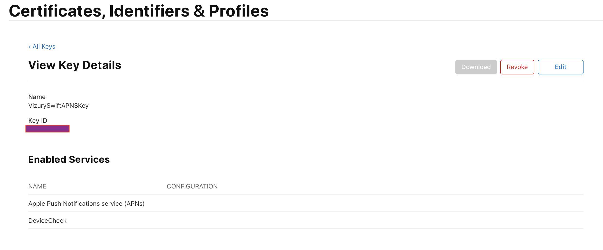
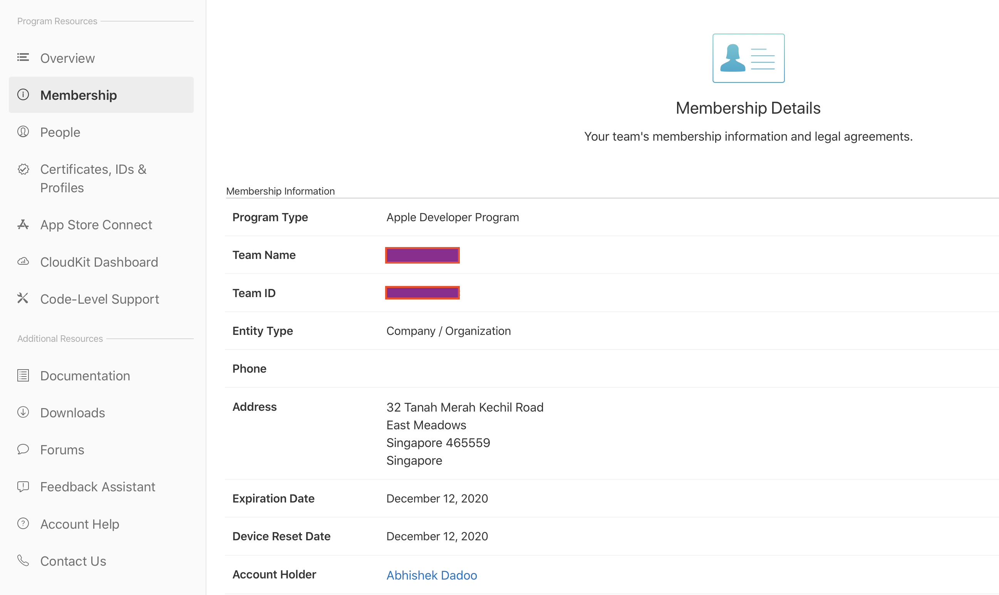

# VizuryEventLogger

[](http://cocoapods.org/pods/VizuryEventLogger)
[](http://cocoapods.org/pods/VizuryEventLogger)

Vizury is a commerce marketing platform and its personalized retargeting stack is used by digital companies to grow marketing ROI and enhance transactions. 


## Summary
 This is iOS SDK integration guide. The SDK supports iOS9 and above.

## Basic Integration

### Integration through CocoaPods
CocoaPods is a dependency manager for Objective C & Swift projects and makes integration easier.

1. If you don't have CocoaPods installed, you can do it by executing the following line in your terminal.

    ```sudo gem install cocoapods```
    
2. If you don't have a Podfile, create a plain text file named Podfile in the Xcode project directory with the following content, making sure to set the platform and version that matches your app.

    ```pod 'VizuryEventLogger'```<br>
    ```pod 'VizuryRichNotification'```
    
    To avoid unwanted issues, please add the following Firebase pod:<br>
    ```pod 'Firebase/Messaging'```
    
3. Install `VizuryEventLogger` and `VizuryRichNotification` SDK by executing the following in the Xcode project directory.

    ```pod install```
    
4. Now, open your project workspace and check if `VizuryEventLogger` and `VizuryRichNotification` SDK is properly added.

### Vizury SDK Initialization

  In your `AppDelegate` file import the `VizuryEventLogger`

#### Objective-C
----  
 ```objc
 #import <VizuryEventLogger/VizuryEventLogger.h>
 ```
 
 Add the following in `didFinishLaunchingWithOptions` method of AppDelegate to initialize the SDK
 
```objc
  [VizuryEventLogger initializeEventLoggerInApplication:(UIApplication*)application
                            WithPackageId:(NSString *)packageId
                            ServerURL:(NSString *)serverURL
                            WithCachingEnabled:(BOOL) caching
                            AndWithFCMEnabled:(BOOL) isFCMEnabled];
```

#### Swift
---- 
 ```objc
 #import VizuryEventLogger
 ```
 
 Update your AppDelegate 
 
 ```swift
 class AppDelegate: UIResponder, UIApplicationDelegate, UNUserNotificationCenterDelegate
 ```
 
 Add the following in `didFinishLaunchingWithOptions` method of AppDelegate to initialize the SDK
 
```objc
VizuryEventLogger.initializeEventLogger(in: application,
			withPackageId: packageId, 
			serverURL: serverUrl,
			withCachingEnabled: caching, 
			AndWithFCMEnabled: isFCMEnabled)
```

```
Where 
  packageId     : packageId obtained from vizury
  serverURL     : serverURL obtained from vizury
  caching       : pass true if your app supports offline usage and you want to send user behaviour data 
                  to vizury while he was offline. Pass false otherwise
  isFCMEnabled  : true/false depending on if you want to use vizury for push
``` 
 
Thats it!! SDK is successfully integrated and initialized in the project, and ready to use.

### Event Logging

When a user browse through the app, various activities happen e.g. visiting a product, adding the product to cart, making purchase, etc. These are called events. Corresponding to each event, app needs to pass certain variables to the SDK which the SDK will automatically pass to Vizury servers.

#### Objective-C
----
Create an attributeDictionary with the attributes associated with the event and call `[VizuryEventLogger logEvent]` with event name and the attributeDictionary.

```objc
    #import <VizuryEventLogger/VizuryEventLogger.h>

    NSDictionary *attributeDictionary  =   [[NSDictionary alloc] initWithObjectsAndKeys:
                                            @"AKSJDASNBD",@"productid",
                                            @"789", @"productPrice",
                                            @"Shirt",@"category",
                                            nil];

    [VizuryEventLogger logEvent:@"productPage" WithAttributes:attributeDictionary];
    
    // sending a JSONObject
    NSDictionary *productDetail = [NSDictionary dictionaryWithObjectsAndKeys:
                                   @"62112",@"product_id",
                                   @"1",@"quantity",
                                   @"50", @"price",
                                   nil];
    
    NSData *productjsonData = [NSJSONSerialization dataWithJSONObject:productDetail options:0 error:nil];
    NSString *productjsonStr = [[NSString alloc] initWithData:productjsonData encoding:NSUTF8StringEncoding];
    
    NSDictionary *productjsonDictionary = [NSDictionary dictionaryWithObjectsAndKeys:
                                           productjsonStr,@"viz_data",
                                           nil];
    [VizuryEventLogger logEvent:@"productDetails" WithAttributes:productjsonDictionary];
```

#### Swift
----
Create an attributeDictionary with the attributes associated with the event and call `VizuryEventLogger.logEvent with event name and the attributeDictionary.

```swift
        let attributeDictionary = [ "productId":"AKSJDASNBD",
                                        "price" : "999",
                                        "category" : "shirt"]
        VizuryEventLogger.logEvent("productPage", withAttributes: attributeDictionary)
```	

## Push Notifications

For sending push notifications we are using GCM-APNS interface. For this you need to configure the App for push notifications in [Apple Developer Member Center](https://developer.apple.com/membercenter/index.action) and get a configuration file from google.

### Configuring Apple Developer Settings

To enable sending Push Notifications through APNs, you need

a) Create the authentication key.

b) Create an App ID

c) Provisioning profile for that App ID.

You can create them in the [Apple Developer Member Center](https://developer.apple.com/membercenter/index.action) by following [these steps](https://firebase.google.com/docs/cloud-messaging/ios/certs)


### Configuring project for FCM

#### Set up CocoaPods dependencies

* If you don't have an Xcode project yet, create one now
* Create a Podfile if you don't have one

```
$ cd your-project directory
$ pod init
```

* Add the `Firebase/Messaging` pod

```
pod 'Firebase/Messaging'
```

* Install the pods and open the .xcworkspace file to see the project in Xcode

```
$ pod install
$ open your-project.xcworkspace
```

#### Enabling FCM

Create a Firebase project in the [Firebase console](https://console.firebase.google.com/u/0/) if you don't already have one. Enter the `Project-Name`.



Click on `iOS` option and in the next screen add the `iOS Bundle Id`. The `iOS Bundle Id` should be same as your apps bundle identifier. You can download the `GoogleService-Info.plist` file in the next step.


`Note : The GoogleService-Info.plist file that you have downloaded will have certain settings like IS_ADS_ENABLED, IS_SIGNIN_ENABLED set as YES. You have to add correspinding pod dependencies for the same or you can turn them off if you are not using them`

Next click on the `Settings icon` option of the created project.



Click on `Cloud Messaging` tab and upload APNs Authentication Key (.p8 format). Also note down the the `Server key` as this will be required later during the integration. You can also upload APNs certificaties but configuration with auth keys is recommended as they are the more current method for sending notifications to iOS



While uploading APNs Authentication Key (.p8 format) you need to enter the Key Id and Team Id. 
1. 'Key ID' is the id of the authentication key you created in Apple developer console under `Certificates, Identifiers & Profiles` -> Keys -> Select the particular certificate.



2. 'Team ID' is the Team Member ID in Apple developer console under Membership -> Membership Details



### Configuring Application

* Drag the GoogleService-Info.plist file you just downloaded into the root of your Xcode project and add it to all targets
* Register for Push notifications inside `didFinishLaunchingWithOptions` method of you `AppDelegate`

#### Objective-C
----
```objc
    // Register for remote notifications. This shows a permission dialog on first run, to
    // show the dialog at a more appropriate time move this registration accordingly.
    if (floor(NSFoundationVersionNumber) <= NSFoundationVersionNumber_iOS_7_1) {
        // iOS 7.1 or earlier. Disable the deprecation warnings.
        #pragma clang diagnostic push
        #pragma clang diagnostic ignored "-Wdeprecated-declarations"
        UIRemoteNotificationType allNotificationTypes =
        (UIRemoteNotificationTypeSound | UIRemoteNotificationTypeAlert | UIRemoteNotificationTypeBadge);
        [application registerForRemoteNotificationTypes:allNotificationTypes];
        #pragma clang diagnostic pop
    } else {
        // iOS 8 or later
        // [START register_for_notifications]
        if (floor(NSFoundationVersionNumber) <= NSFoundationVersionNumber_iOS_9_x_Max) {
            #pragma clang diagnostic push
            #pragma clang diagnostic ignored "-Wdeprecated-declarations"
            UIUserNotificationType allNotificationTypes =
            (UIUserNotificationTypeSound | UIUserNotificationTypeAlert | UIUserNotificationTypeBadge);
            UIUserNotificationSettings *settings =
            [UIUserNotificationSettings settingsForTypes:allNotificationTypes categories:nil];
            [[UIApplication sharedApplication] registerUserNotificationSettings:settings];
        } else {
            // iOS 10 or later
            #if defined(__IPHONE_10_0) && __IPHONE_OS_VERSION_MAX_ALLOWED >= __IPHONE_10_0
            // For iOS 10 display notification (sent via APNS)
            [UNUserNotificationCenter currentNotificationCenter].delegate = self;
            UNAuthorizationOptions authOptions =
            UNAuthorizationOptionAlert | UNAuthorizationOptionSound | UNAuthorizationOptionBadge;
            [[UNUserNotificationCenter currentNotificationCenter] requestAuthorizationWithOptions:authOptions completionHandler:^(BOOL granted, NSError * _Nullable error) {
            }];
            #endif
        }
        
        [[UIApplication sharedApplication] registerForRemoteNotifications];
        // [END register_for_notifications]
```

#### Swift
----
```swift
        if #available(iOS 10.0, *) {
            let authOptions: UNAuthorizationOptions = [.alert, .badge, .sound]
            UNUserNotificationCenter.current().requestAuthorization(
                options: authOptions,
                completionHandler: {_, _ in })
            UNUserNotificationCenter.current().delegate = self
        } else {
            let settings: UIUserNotificationSettings =
                UIUserNotificationSettings(types: [.alert, .badge, .sound], categories: nil)
            application.registerUserNotificationSettings(settings)
        }
        application.registerForRemoteNotifications()
```

* For iOS10 and above you also need to add the below code. You can refer to the example app.

```objc
#if defined(__IPHONE_10_0) && __IPHONE_OS_VERSION_MAX_ALLOWED >= __IPHONE_10_0
@import UserNotifications;
#endif

// Implement UNUserNotificationCenterDelegate to receive display notification via APNS for devices
// running iOS 10 and above.
#if defined(__IPHONE_10_0) && __IPHONE_OS_VERSION_MAX_ALLOWED >= __IPHONE_10_0
@interface AppDelegate () <UNUserNotificationCenterDelegate>
@end
#endif

```

* Post Registration 

Pass the APNS token to Vizury

#### Objective-C
----
```objc
- (void)application:(UIApplication *)application didRegisterForRemoteNotificationsWithDeviceToken:(NSData *)deviceToken {

    [VizuryEventLogger registerForPushWithToken:deviceToken];
}
```

#### Swift
-----
```swift
    func application(_ application: UIApplication, didRegisterForRemoteNotificationsWithDeviceToken deviceToken: Data) {
        VizuryEventLogger.registerForPush(withToken: deviceToken)
    }
```

In case of any failed registration

#### Objective-C
----
```objc
- (void)application:(UIApplication *)application didFailToRegisterForRemoteNotificationsWithError:(NSError *)error {

    [VizuryEventLogger didFailToRegisterForPush];
}
```

#### Swift
-----
```swift
    func application(_ application: UIApplication, didFailToRegisterForRemoteNotificationsWithError error: Error) {
        VizuryEventLogger.didFailToRegisterForPush()
    }
```    

* Handling notification payload

#### Objective-C
-----
```objc
- (void)application:(UIApplication *)application didReceiveRemoteNotification:(NSDictionary *)userInfo fetchCompletionHandler:(void (^)(							UIBackgroundFetchResult))completionHandler {
    [VizuryEventLogger didReceiveRemoteNotificationInApplication:application withUserInfo:userInfo];
 }
```

#### Swift
----
```swift
    func application(_ application: UIApplication, didReceiveRemoteNotification userInfo: [AnyHashable: Any], fetchCompletionHandler 			completionHandler: @escaping (UIBackgroundFetchResult) -> Void) {        
        VizuryEventLogger.didReceiveRemoteNotification(in: application, withUserInfo: userInfo)
        if (application.applicationState == UIApplicationState.inactive) {
            self.customPushHandler(userInfo: userInfo)
        }
        completionHandler(UIBackgroundFetchResult.newData)
    }
    
    @available(iOS 10.0, *)
    func userNotificationCenter(_ center: UNUserNotificationCenter, didReceive response: UNNotificationResponse, withCompletionHandler 			completionHandler: @escaping () -> Void) {
        let pushDictionary = response.notification.request.content.userInfo
        VizuryEventLogger.didReceiveResponse(userInfo: pushDictionary)
        self.customPushHandler(userInfo: pushDictionary)
        completionHandler();
    }
```

### Deeplinks

In order to open Deep Links that are sent to the device as a Key/Value pair along with a push notification you must implement a custom handler

#### Objective-C
-----
```objc
- (void)application:(UIApplication *)application didReceiveRemoteNotification:(NSDictionary *)userInfo fetchCompletionHandler:(void (^)(							UIBackgroundFetchResult))completionHandler {
    [VizuryEventLogger didReceiveRemoteNotificationInApplication:application withUserInfo:userInfo];
    if(application.applicationState == UIApplicationStateInactive) {
        NSLog(@"Appilication Inactive - the user has tapped in the notification when app was closed or in background");
    	[self customPushHandler:userInfo];
    }
 }

- (void) customPushHandler:(NSDictionary *)notification {
    if (notification !=nil && [notification objectForKey:@"deeplink"] != nil) {
        NSString* deeplink = [notification objectForKey:@"deeplink"];
        NSLog(@"%@",deeplink);
        // Here based on the deeplink you can open specific screens that's part of your app
    }
}
```

#### Swift
----
```swift
    func application(_ application: UIApplication, didReceiveRemoteNotification userInfo: [AnyHashable: Any], fetchCompletionHandler 			completionHandler: @escaping (UIBackgroundFetchResult) -> Void) {        
        VizuryEventLogger.didReceiveRemoteNotification(in: application, withUserInfo: userInfo)
        if (application.applicationState == UIApplicationState.inactive) {
            self.customPushHandler(userInfo: userInfo)
        }
        completionHandler(UIBackgroundFetchResult.newData)
    }
    
    @available(iOS 10.0, *)
    func userNotificationCenter(_ center: UNUserNotificationCenter, didReceive response: UNNotificationResponse, withCompletionHandler 			completionHandler: @escaping () -> Void) {
        let pushDictionary = response.notification.request.content.userInfo
        VizuryEventLogger.didReceiveResponse(userInfo: pushDictionary)
        self.customPushHandler(userInfo: pushDictionary)
        completionHandler();
    }
    
    func customPushHandler(userInfo : [AnyHashable : Any]) {        
        if let deeplink =  userInfo[AnyHashable("deeplink")] {
	    // handle the deeplink
            print("deeplink is ", deeplink)
        } 
    }
```

## Support
Please visit this repository's [Github issue tracker](https://github.com/ayon-affle/vizury-ios-sdk/issues) for bug reports specific to our iOS SDK.
For other issues and support please contact Vizury support from your dashboard.


